# AKS and Databricks Migration Case Study

## Problem Statement

We currently run 30+ application workloads across on-prem servers and have 40+ pipeline jobs sitting in Databricks that get deployed by hand with no automated testing. Across 25+ repos this has become pretty hard to manage consistently.

The main gaps are:
- No cloud-native application platform — on-prem schedulers are fragile and can't scale
- Databricks deployments are manual, error-prone, and there's no standard process across teams
- The compute estate is a mix of container instances, VMs, and on-prem servers with no unified operating model

The plan is to migrate everything to AKS and build a proper Databricks CI/CD setup, both built on GitOps and IaC from the start.

---

## Migration Operating Model

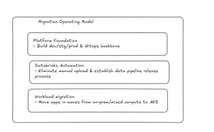

Three streams, run in sequence:

1. **Platform Foundation** - build out Dev/Stg/Prod on AKS with a GitOps backbone
2. **Databricks Automation** - eliminate manual uploads, get all 40+ jobs on a proper release process
3. **Workload Migration** - move apps in waves from on-prem and mixed compute

---

## Programme Roadmap

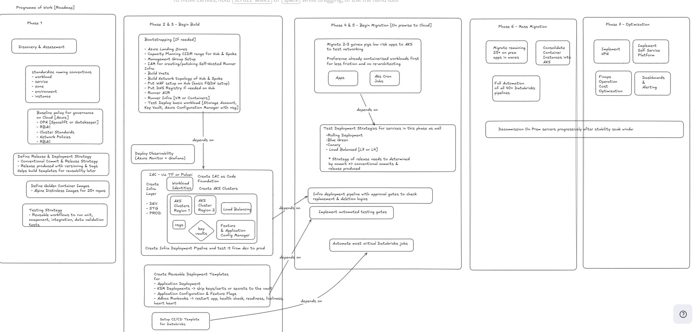

### Phase 1: Discovery and Assessment
- Lock down naming conventions (workload, service, zone, environment, instance)
- Get baseline governance in place on Azure: OPA via Spacelift or Gatekeeper, RBAC, cluster standards, network policies
- Define the release and deployment strategy using Conventional Commits and semantic versioning
- Build Golden Container Images (Alpine Distroless base) shared across all repos
- Define the testing strategy: unit, component, integration, data validation — reusable workflows

### Phase 2 and 3: Build Platform Foundation
- Bootstrap Azure Landing Zones: CIDR planning, Management Groups, IAM for runner infra
- Build Hub and Spoke VNet topology, WAF, DNS registry, runner infra
- Deploy observability: Azure Monitor and Grafana
- Provision AKS clusters (Dev/Stg/Prod) via IaC (Pulumi or Terraform) — NSGs, Key Vaults, App Config, Managed Identities
- Bootstrap Argo CD onto each cluster from the Platform Monorepo
- Build reusable deployment templates: app deploy, KSM secrets, feature flags, runbooks
- Set up the CI/CD template for Databricks

### Phase 4 and 5: Start Migration (On-Prem to Cloud)
- Start with 2-3 low-risk apps to validate AKS networking and GitOps flow
- Prefer already-containerised workloads first — less re-architecting
- Test deployment strategies: Rolling, Blue/Green, Canary, Load Balanced (L4/L7)
- Add approval gates and automated testing gates to the infra pipeline
- Automate the most critical Databricks jobs

### Phase 6: Mass Migration
- Migrate the remaining 25+ on-prem apps in waves
- Consolidate all Container Instances into AKS
- Full automation of all 40+ Databricks pipelines
- Progressively decommission on-prem servers after a stability soak window

### Phase 7: Optimisation
- HPA across services
- Self-service platform for app teams
- FinOps: cost controls, right-sizing, operational cost optimisation
- Dashboards and alerting (SLOs, DORA metrics)

---

## Platform Architecture and Technology Decisions

### Target Platform Layers

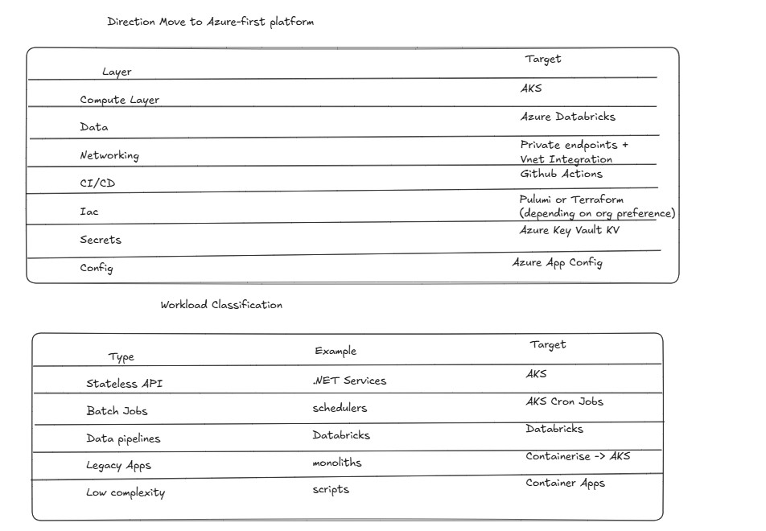

Azure-first across the board:

| Layer | Target |
|---|---|
| Compute | Azure Kubernetes Service (AKS) |
| Data Pipelines | Azure Databricks |
| Networking | Private Endpoints and VNet Integration |
| CI/CD | GitHub Actions |
| IaC | Pulumi or Terraform (org preference) |
| Secrets | Azure Key Vault |
| Config | Azure App Configuration |

### Workload Classification

| Type | Example | Target Platform |
|---|---|---|
| Stateless API | .NET Services | AKS |
| Batch / Scheduled Jobs | On-prem schedulers | AKS CronJobs |
| Data Pipelines | Databricks notebooks | Azure Databricks |
| Legacy Monoliths | Containerised and lifted | AKS |
| Low Complexity Scripts | Scripts | Azure Container Apps |

### Build vs Buy

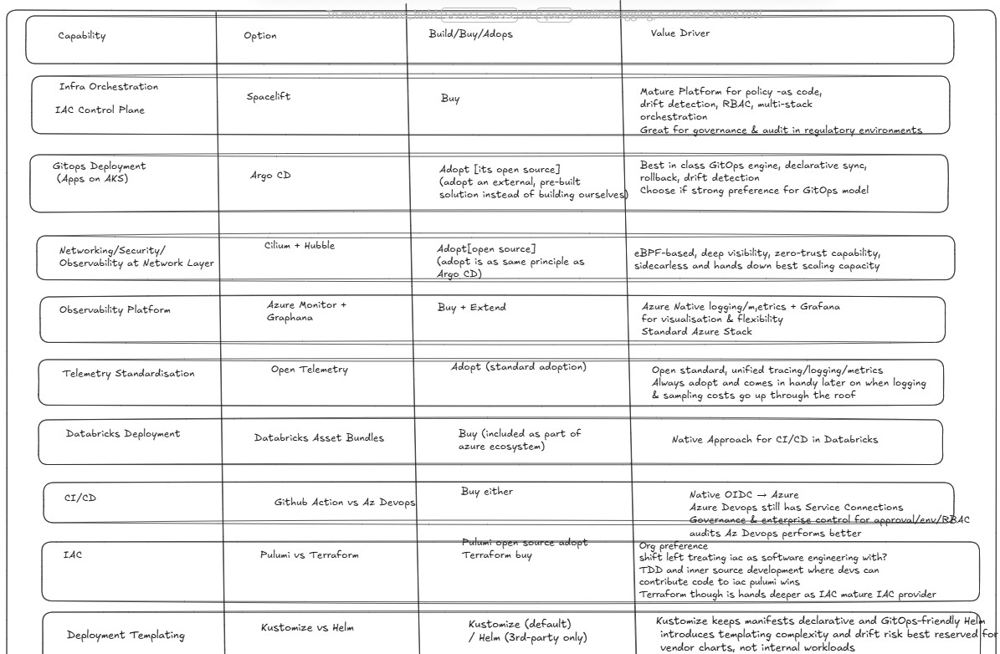

| Capability | Choice | Decision | Rationale |
|---|---|---|---|
| IaC Control Plane | Spacelift | Buy | Policy-as-code, drift detection, multi-stack RBAC, strong governance for regulated environments |
| GitOps (AKS) | Argo CD | Adopt | Best-in-class declarative sync, drift detection, rollback |
| Networking/Security | Cilium + Hubble | Adopt | eBPF-based zero-trust, sidecarless, best east-west visibility and scaling |
| Observability | Azure Monitor + Grafana | Buy + Extend | Native Azure stack plus flexible visualisation |
| Telemetry | OpenTelemetry | Adopt | Open standard; unified tracing, logging, and metrics |
| Databricks Deployment | Databricks Asset Bundles | Buy | Native CI/CD approach, included in Azure ecosystem |
| CI/CD | GitHub Actions / Azure DevOps | Buy either | GitHub Actions for OIDC-native flow; Azure DevOps for stricter approval/env/RBAC governance |
| IaC Tooling | Pulumi vs Terraform | Pulumi (adopt) / Terraform (buy) | Pulumi enables TDD and inner-source dev; Terraform has a more mature provider ecosystem |
| Deployment Templating | Kustomize vs Helm | Kustomize (default) / Helm (3rd-party only) | Kustomize keeps manifests declarative and GitOps-friendly Helm introduces templating complexity and drift risk best reserved for vendor charts, not internal workloads

---

## AKS Platform Design

### Network Architecture

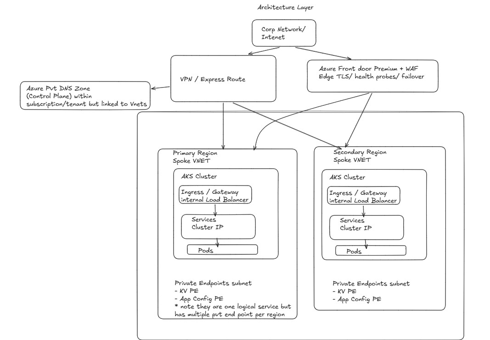

Hub and Spoke VNet topology across two Azure regions:

- Internet traffic goes through Azure Front Door Premium and WAF (Edge TLS, health probes, failover)
- Corporate access via VPN or Express Route
- Azure Private DNS Zone (control plane) linked to each spoke VNet
- Each region has its own Spoke VNet with an AKS cluster: Ingress/Gateway, Internal Load Balancer, Services (Cluster IP), Pods
- Private Endpoints subnet per region for Key Vault and App Config

### Separation of Concerns: IaC vs Service Deployment

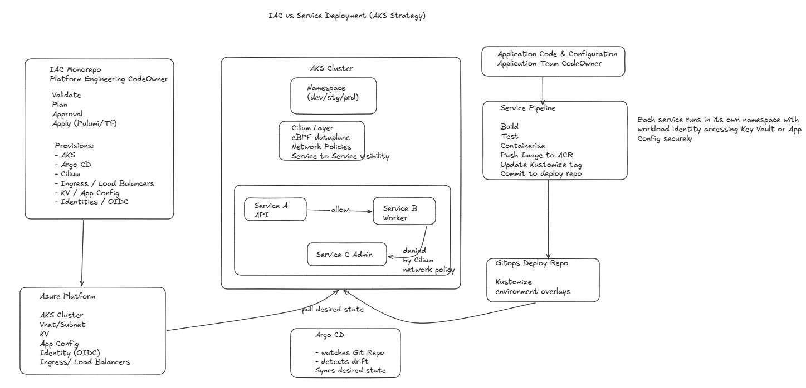

Two clear ownership boundaries:

**Platform Engineering owns the IAC Monorepo**
- Pulumi/Terraform for AKS clusters, VNet/Subnet, KV, App Config, Ingress, OIDC Identities, Argo CD, Cilium
- Pipeline: Validate > Plan > Approval > Apply to Azure

**Application Teams own their Application Repos**
- Source code, Dockerfile, Kustomize manifests, deployment overlays
- Pipeline: PR > Build > Test > Container Scan > Push to ACR > Update Kustomize tag > Commit to Deploy Repo > Argo CD > AKS

Each service gets its own namespace with Workload Identity scoped to Key Vault and App Config.

### Pipeline Flows

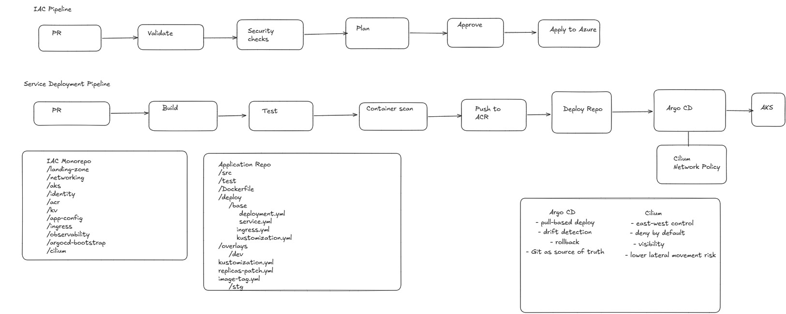

**IaC pipeline:** PR > Validate > Security Checks > Plan > Approve > Apply to Azure

**Service deployment pipeline:** PR > Build > Test > Container Scan > Push to ACR > Deploy Repo > Argo CD > AKS

Argo CD handles pull-based GitOps with drift detection and rollback. Cilium enforces east-west network policy with deny-by-default.

**Repo structure:**

```
# IAC Monorepo
/landing-zone   /networking   /aks   /identity
/acr   /kv   /app-config   /ingress   /observability
/argocd-bootstrap   /cilium

# Application Repo
/src   /test   /Dockerfile
/deploy/base
  deployment.yml   service.yml   ingress.yml   kustomization.yml
/deploy/overlays/dev   /deploy/overlays/stg   /deploy/overlays/prod
```

### AKS Build Sequence

#### Phase 1: Build Landing Zone

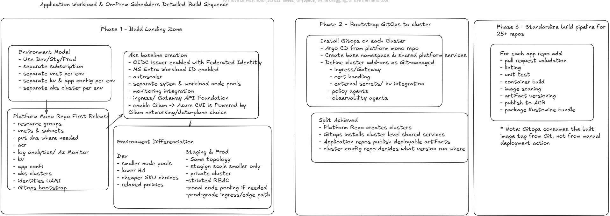

Separate Azure subscription, VNet, Key Vault, App Config, and AKS cluster per environment (Dev/Stg/Prod).

The Platform Monorepo first release provisions: resource groups, VNets and subnets, private DNS, ACR, Log Analytics, Azure Monitor, Key Vault, App Config, AKS clusters, User-Assigned Managed Identities, and GitOps bootstrap.

AKS baseline:
- OIDC issuer with Federated Identity (MS Entra Workload ID)
- Autoscaler with separate system and workload node pools
- Monitoring integration
- Ingress/Gateway API Foundation
- Azure CNI powered by Cilium

Environment differences:

| | Dev | Staging and Prod |
|---|---|---|
| Node pools | Smaller | Same topology |
| HA | Lower | Full HA, zonal node pooling |
| SKU | Cheaper | Prod-grade |
| Cluster | Shared | Private cluster |
| RBAC | Relaxed | Strict |
| Ingress | Basic | Prod-grade edge path |

#### Phase 2: Bootstrap GitOps

- Install Argo CD on each cluster from the Platform Monorepo
- Create base namespaces and shared platform services
- Define cluster add-ons as Git-managed: ingress/gateway, cert handling, external secrets, policy agents, observability agents

Who owns what:

| Repo | Responsibility |
|---|---|
| Platform Repo | Creates clusters |
| Argo CD | Installs cluster-level shared services |
| Application Repos | Publish deployable artifacts |
| Cluster Config Repo | Decides what version runs where |

#### Phase 3: Standardise Build Pipeline (25+ Repos)

For every app repo, add:
- PR validation, linting, unit tests
- Container build, image scanning, artifact versioning
- Publish to ACR, package Kustomize bundle

> GitOps picks up the image tag from Git, not from a manual deployment trigger.

#### Phases 4-7: Workload Migration Waves

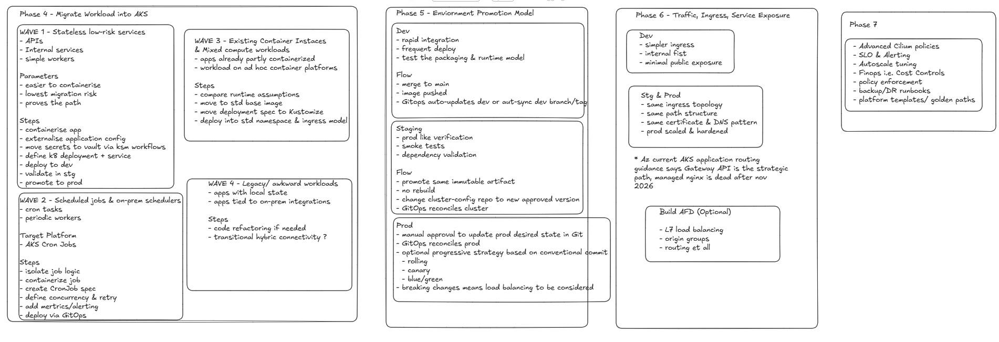

| Wave | Workload Type | Steps |
|---|---|---|
| Wave 1 | Stateless low-risk APIs and workers | Containerise, externalise config, move secrets to KV via KSM, define k8s Deployment and Service, deploy dev > validate stg > promote prod |
| Wave 2 | Scheduled jobs and on-prem schedulers | Isolate job logic, containerise, create CronJob spec, define concurrency and retry, add metrics/alerting, deploy via GitOps |
| Wave 3 | Existing Container Instances and mixed compute | Compare runtime assumptions, move to standard base image, migrate deployment spec to Kustomize |
| Wave 4 | Legacy and awkward workloads | Refactor where needed, transitional hybrid connectivity |

Environment promotion:

| Environment | Behaviour |
|---|---|
| Dev | Rapid integration, frequent deploys, tests packaging and runtime model. Auto-syncs on merge to main |
| Staging | Prod-like verification, smoke tests, dependency validation. Same immutable artifact, no rebuild |
| Prod | Manual approval gate in Git. GitOps reconciles. Strategy (rolling/canary/blue-green) driven by commit type |

---

## Generic Deployment Lifecycle

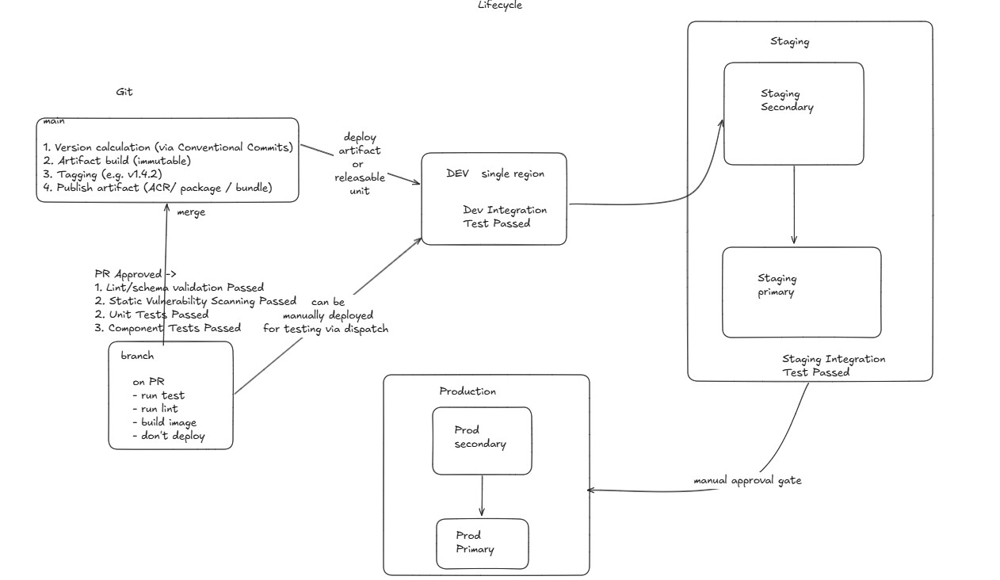

Same flow for all workloads — AKS services and Databricks pipelines.

On a branch (PR): run tests, linting, build image. Don't deploy.

On PR approval:
1. Lint/schema validation passed
2. Static vulnerability scanning passed
3. Unit tests passed
4. Component tests passed

On merge to `main`:
1. Version calculated via [Conventional Commits](https://www.conventionalcommits.org/) and semantic versioning
2. Immutable artifact built
3. Tagged (e.g. `v1.4.2`)
4. Artifact published to ACR / package registry / bundle store

Deployment flow: DEV (single region, integration tests) > Staging Secondary > Staging Primary (integration tests) > manual approval gate > Prod Secondary > Prod Primary

---

## Deployment Strategy

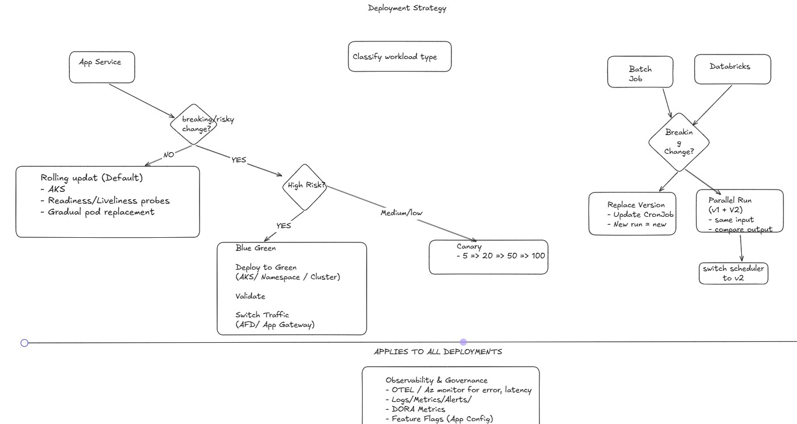

### Application Services on AKS

| Scenario | Strategy |
|---|---|
| Non-breaking change | Rolling Update (readiness/liveness probes, gradual pod replacement) |
| Breaking or high-risk change | Blue/Green (deploy to green namespace or cluster, validate, switch traffic via AFD/App Gateway) |
| Breaking, medium-low risk | Canary (traffic shift: 5% > 20% > 50% > 100%) |

### Batch Jobs and Databricks Pipelines

| Scenario | Strategy |
|---|---|
| Non-breaking change | Replace version (update CronJob/job definition, new run = new version) |
| Breaking change | Parallel run v1 and v2 (same input, compare output, switch scheduler to v2) |

Across all deployments: OpenTelemetry and Azure Monitor for error/latency, logs/metrics/alerts, DORA metrics, feature flags via App Config.

---

## Databricks Design

### Architecture and Ownership

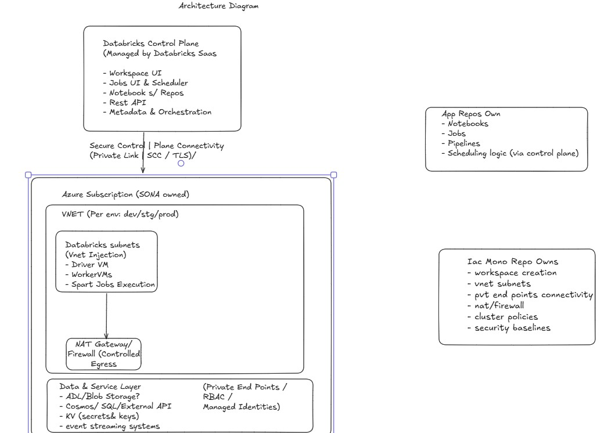

The Databricks Control Plane is managed SaaS (Workspace UI, Jobs, Notebooks, REST API, Metadata and Orchestration), connected via Private Link / SCC / TLS.

The Azure subscription (org-owned) per environment (Dev/Stg/Prod) contains:
- VNet with Databricks subnets via VNet Injection (Driver VM, Worker VMs, Spark job execution)
- NAT Gateway / Firewall for controlled egress
- Data and service layer: ADLS/Blob, Cosmos/SQL, Key Vault, event streaming — all accessed via Private Endpoints, RBAC, and Managed Identities

Ownership split:

| Owner | Owns |
|---|---|
| Application Repos | Notebooks, Jobs, Pipeline code, Scheduling logic |
| IAC Monorepo | Workspace creation, VNet subnets, private endpoints, NAT/firewall, cluster policies, security baselines |

### Developer Workflow

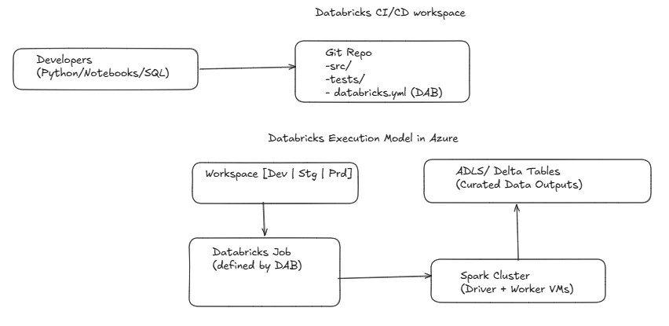

Developers (Python / Notebooks / SQL) work from a Git repo structured as:

```
/src             # pipeline code
/tests/          # unit and integration tests
databricks.yml   # Databricks Asset Bundle (DAB) definition
```

Execution in Azure: Workspace (Dev/Stg/Prd) > Databricks Job (defined by DAB) > Spark Cluster (Driver and Worker VMs) > ADLS / Delta Tables (curated outputs)

### Databricks Project Plan

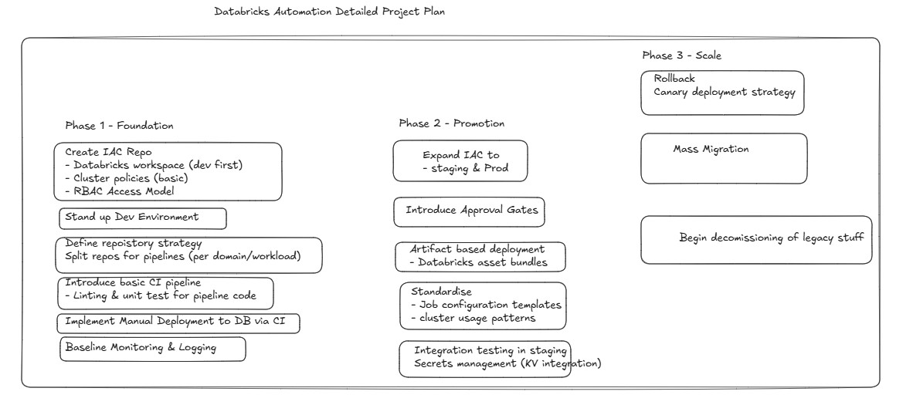

#### Phase 1: Foundation
- Create IAC repo: Databricks workspace (Dev first), cluster policies, RBAC access model
- Stand up Dev environment
- Define repo strategy: split per domain/workload
- Basic CI pipeline: linting and unit tests for pipeline code
- Manual-triggered deployment to Databricks via CI
- Baseline monitoring and logging

#### Phase 2: Promotion
- Expand IAC to Staging and Prod
- Introduce approval gates
- Artifact-based deployment using Databricks Asset Bundles
- Standardise job configuration templates and cluster usage patterns
- Integration testing in Staging
- Secrets management via Key Vault integration

#### Phase 3: Scale
- Rollback and canary deployment for pipelines
- Mass migration of all 40+ jobs
- Begin decommissioning legacy manual processes

### IaC Pipeline for Databricks Workspaces

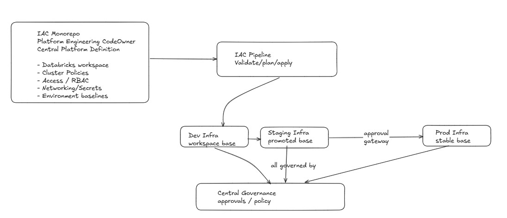

Platform Engineering owns the central IAC Monorepo which defines: workspace config, cluster policies, access/RBAC, networking/secrets, and environment baselines.

Flow: IAC Monorepo > IAC Pipeline (validate/plan/apply) > Dev workspace > Staging (promoted base) > approval gate > Prod (stable base)

All environments governed by central governance approvals and policy.

### Application CI/CD Pipeline

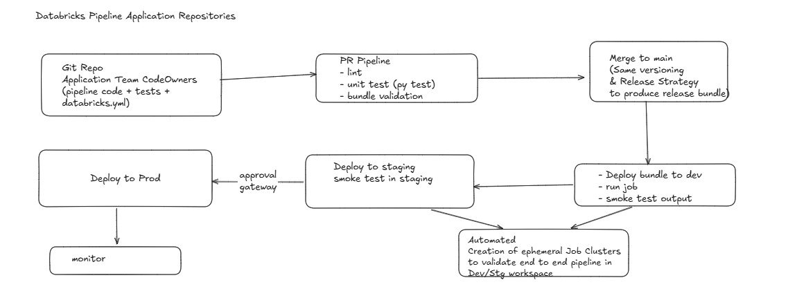

```
Git Repo (App Team CodeOwners)
  pipeline code + tests + databricks.yml
        |
        v
PR Pipeline: lint > unit test (pytest) > bundle validation
        |
        v
Merge to main: version and release bundle produced
        |
        v
Deploy bundle to Dev > run job > smoke test output
        |                    |
        |         Automated ephemeral Job Clusters
        |         (end-to-end validation, Dev/Stg workspace)
        v
Deploy to Staging > smoke test in Staging
        |
        v  approval gate
Deploy to Prod > Monitor
```

---

## Appendix

| Diagram | Link |
|---|---|
| Migration Operating Model | [View](images/majorstreamoperatingmodel.jpg) |
| Programme Roadmap | [View](images/productroadmap.jpg) |
| Workload Classification and Platform Layers | [View](images/workloadclassification.jpg) |
| Generic Deployment Lifecycle | [View](images/lifecycle.jpg) |
| AKS Network Architecture | [View](images/aks/aksarchitecturenetwork.jpg) |
| IaC vs Service Deployment Strategy | [View](images/aks/iacvsservicedeploymentstrategy.jpg) |
| IaC vs Service Deployment Pipeline Flow | [View](images/aks/iacvsservicedeploymentpipelineflow.jpg) |
| Detailed Build Sequence Part 1 (Phases 1-3) | [View](images/aks/detailedbuildsequencepart1.jpg) |
| Detailed Build Sequence Part 2 (Phases 4-7) | [View](images/aks/detailedbuildsequencepart2.jpg) |
| Deployment Strategy | [View](images/deploymentstrategy.jpg) |
| Build vs Buy | [View](images/buildvsbuy.jpg) |
| Databricks Architecture and Ownership | [View](images/databricks/databricksarchitectureownership.jpg) |
| Databricks CI/CD Workspace | [View](images/databricks/databrickscicdworkspace.jpg) |
| Databricks Project Plan | [View](images/databricks/databricksprojectplan.jpg) |
| Databricks IaC Pipeline | [View](images/databricks/databricksiac.jpg) |
| Databricks Application CI/CD Pipeline | [View](images/databricks/databricksapplicationcicd.jpg) |
